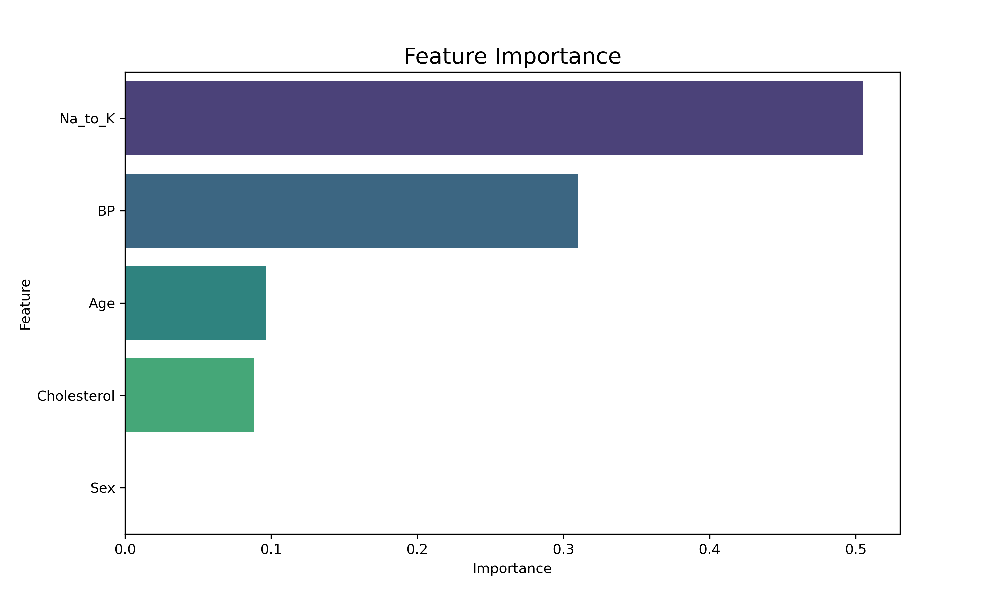
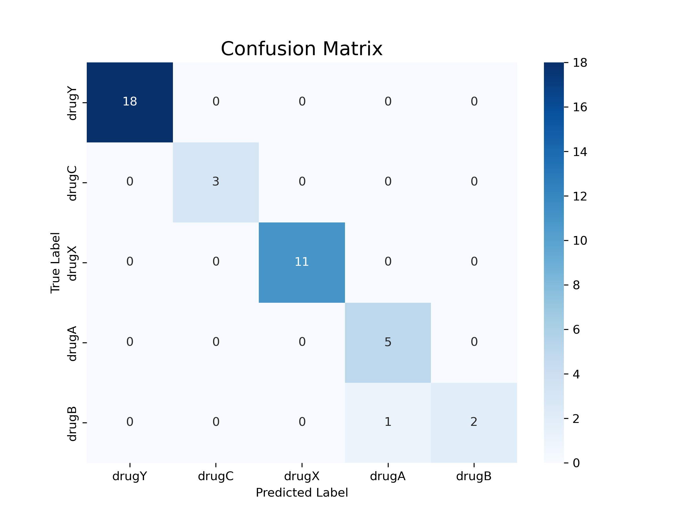
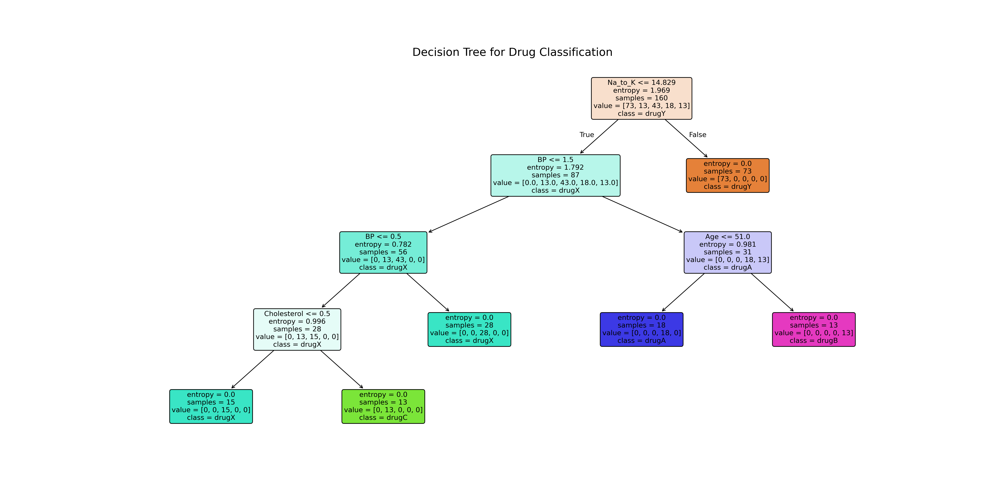

# Decision Tree for Drug Classification

This project demonstrates how to build, train, evaluate, and visualize a decision tree classifier for predicting the appropriate drug for a patient based on their health metrics.

## Motivation

I wanted to explore the interpretability of machine learning models. Decision trees are a perfect example of a "white-box" model, as their decision-making process is transparent and easy to understand. This project focuses on building an interpretable yet accurate classifier.

## Features

-   **Data Preprocessing**: Uses explicit mappings to encode categorical variables (`Sex`, `BP`, `Cholesterol`) into a machine-readable format.
-   **Model Training**: Trains a `DecisionTreeClassifier` using the entropy criterion to handle the multi-class classification task.
-   **Comprehensive Evaluation**: Assesses model performance using accuracy, a detailed classification report (precision, recall, F1-score), and a confusion matrix.
-   **Rich Visualization**:
    -   Plots the full decision tree, showing the rules at each node.
    -   Visualizes the confusion matrix to analyze class-specific performance.
    -   Displays feature importances to identify the most influential patient metrics.

## Dataset

This project uses the **Drug Classification** dataset, which is included in this repository as `drug200.csv`. The dataset contains patient information and the drug that was effective for them.

-   **Features**: `Age`, `Sex`, `Blood Pressure (BP)`, `Cholesterol`, `Sodium to Potassium Ratio (Na_to_K)`
-   **Target**: `Drug` (drugY, drugC, drugX, drugA, drugB)

## Methodology

The project follows these steps:
1.  **Load Data**: Reads the `drug200.csv` file.
2.  **Preprocess**: Converts categorical features (Sex, BP, Cholesterol) and the target variable (Drug) into numerical representations.
3.  **Split Data**: Divides the dataset into training (80%) and testing (20%) sets, using stratification to maintain the same proportion of classes in both sets.
4.  **Train Model**: Trains a decision tree classifier on the training data. A `max_depth` of 4 is used to create a model that is both accurate and easy to visualize.
5.  **Evaluate**: Makes predictions on the test set and evaluates the model's performance.
6.  **Visualize**: Creates and saves plots for the decision tree, confusion matrix, and feature importances.

## Setup

Install the required Python libraries:
```bash
pip install pandas matplotlib seaborn scikit-learn
```

## Usage

Run the script from your terminal:

-Clone the repository:

```bash
git clone "https://github.com/Sat1x/decision-tree-drug"
```

-Run the script:

```bash
python drug_classification_dt.py
```

## Outputs

The script will print a detailed evaluation and save the following plots:
-   `decision_tree.png`: A high-resolution image of the complete decision tree.
-   `confusion_matrix.png`: A heatmap showing the model's prediction accuracy for each drug type.
-   `feature_importance.png`: A bar chart ranking the features by their influence on the prediction.

## Results

### Feature Importance
The analysis clearly shows that the `Na_to_K` (Sodium to Potassium Ratio) is the most critical factor in determining the correct drug, followed by blood pressure and age.



### Confusion Matrix
The confusion matrix shows excellent performance, with nearly all predictions on the diagonal, indicating that the model correctly classified the drug for each patient in the test set.



### Decision Tree
The visualized tree provides a clear, rule-based model for understanding how a prediction is made. For example, if a patient's `Na_to_K` ratio is greater than 14.829, the model will always prescribe `drugY`.



## Stats

Accuracy: 0.9750

Classification Report:

              precision    recall  f1-score   support

       drugY       1.00      1.00      1.00        18
       drugC       1.00      1.00      1.00         3
       drugX       1.00      1.00      1.00        11
       drugA       0.83      1.00      0.91         5
       drugB       1.00      0.67      0.80         3


       accuracy                            0.97        40
       macro avg       0.97      0.93      0.94        40
       weighted avg    0.98      0.97      0.97        40

## What I Learned

-   **Interpretability**: How to build and visualize a "white-box" model whose decisions are easily understood.
-   **Feature Engineering**: The importance of correctly encoding categorical variables for machine learning models.
-   **Model Evaluation**: How to go beyond accuracy and use tools like classification reports and confusion matrices to understand a model's strengths and weaknesses.
-   **Hyperparameter Tuning**: How parameters like `max_depth` can be used to control the complexity of a decision tree and prevent overfitting.
-   **Feature Importance**: How to extract and visualize the most influential features from a trained model.

## Challenges

-   **Readability**: Tuning the visualization parameters (`figsize`, `fontsize`) to ensure a complex tree is still readable.
-   **Overfitting**: Balancing model depth (`max_depth`) to create a model that generalizes well to new data without being overly complex.
-   **Data Encoding**: Choosing the right strategy to convert categorical data into numerical data without introducing unintended biases.

## License

This project is licensed under the MIT License.